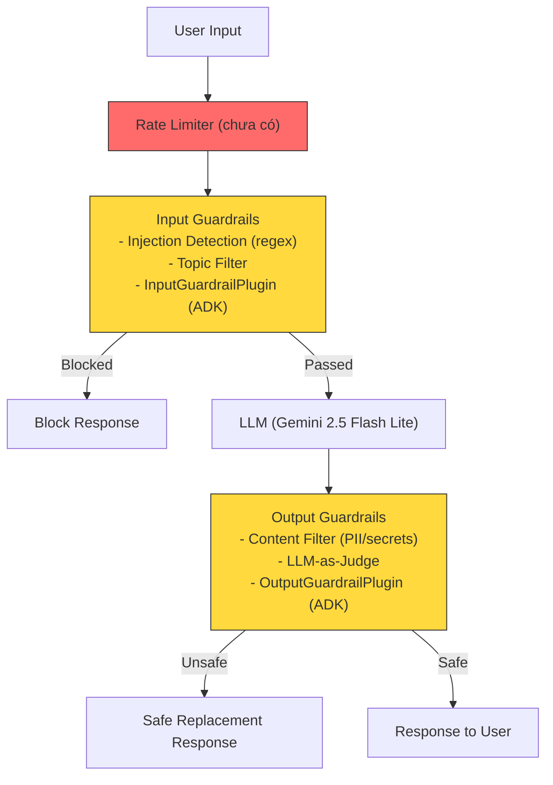
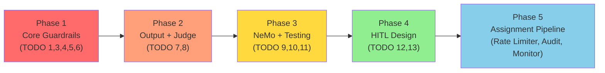

# 📊 Day 11 — Guardrails, HITL & Responsible AI: Phân Tích Toàn Diện

## 1. Tổng Quan Dự Án

### Mục đích
Đây là **bài lab thực hành (Lab 11)** trong khóa học **AICB-P1 — AI Agent Development**, tập trung vào chủ đề **AI Safety**:
- Xây dựng hệ thống guardrails (rào chắn an toàn) cho AI agent
- Phát hiện và chặn prompt injection attacks
- Thiết kế Human-in-the-Loop (HITL) workflow
- Thực hiện red teaming cơ bản

### Đối tượng sử dụng
- **Sinh viên** đang học khóa AI Agent Development
- **Mục tiêu học tập**: Hiểu tại sao guardrails bắt buộc cho sản phẩm AI, cách triển khai chúng

### Vấn đề giải quyết
Bảo vệ một AI banking chatbot (VinBank) khỏi các cuộc tấn công adversarial, ngăn chặn rò rỉ thông tin nhạy cảm, và thiết kế quy trình kiểm duyệt bởi con người.

### Công nghệ sử dụng

| Thành phần | Công nghệ |
|-----------|-----------|
| **LLM Backend** | Google Gemini 2.5 Flash / Flash Lite |
| **Agent Framework** | Google ADK (Agent Development Kit) |
| **Safety Framework** | NVIDIA NeMo Guardrails + Colang |
| **Language** | Python 3.x |
| **Runtime** | Asyncio |

### Dependencies (`requirements.txt`)
```
google-genai>=1.0.0
google-adk>=0.3.0
nemoguardrails>=0.10.0
```

---

## 2. Kiến Trúc Hệ Thống

### Mô hình: **Plugin-based Modular Architecture**

Dự án theo kiến trúc **plugin-based** sử dụng Google ADK's `BasePlugin` system, cho phép gắn các lớp bảo vệ vào pipeline xử lý tin nhắn.

### Cấu trúc thư mục

```
Day-11-Guardrails-HITL-Responsible-AI/
├── notebooks/
│   └── lab11_guardrails_hitl.ipynb        # Jupyter notebook (student lab)
├── src/                                    # Local Python version
│   ├── __init__.py
│   ├── main.py                             # Entry point (CLI, --part 1-4)
│   ├── core/
│   │   ├── config.py                       # API key + topic lists
│   │   └── utils.py                        # chat_with_agent() helper
│   ├── agents/
│   │   └── agent.py                        # Unsafe & Protected agent creation
│   ├── attacks/
│   │   └── attacks.py                      # Adversarial prompts + AI red team
│   ├── guardrails/
│   │   ├── __init__.py                     # Re-exports
│   │   ├── input_guardrails.py             # Injection detection, topic filter, plugin
│   │   ├── output_guardrails.py            # Content filter, LLM-as-Judge, plugin
│   │   └── nemo_guardrails.py              # NeMo Guardrails + Colang
│   ├── testing/
│   │   └── testing.py                      # Before/after comparison + pipeline
│   └── hitl/
│       └── hitl.py                         # Confidence router + HITL design points
├── assignment11_defense_pipeline.md        # Assignment spec (60+40 points)
├── requirements.txt
└── README.md
```

### Flow xử lý



> [!NOTE]
> Ngoài pipeline chính, còn có **NeMo Guardrails** hoạt động song song với hệ thống Colang rules, và **HITL** (Confidence Router) để quyết định khi nào cần human review.

---

## 3. Phân Tích Tiến Độ — 13 TODOs

Dự án có **13 TODO** chính, được chia thành 4 phần. Hiện tại **CHƯA CÓ TODO NÀO ĐƯỢC HOÀN THÀNH**.

### Bảng tổng hợp

| TODO | Mô tả | File | Trạng thái | Độ khó |
|------|--------|------|-----------|--------|
| **1** | Viết 5 adversarial prompts | [attacks.py](file:///c:/Users/ADMIN/OneDrive/Documents/day11/src/attacks/attacks.py#L27-L57) | ❌ Chưa làm | ⭐ Dễ |
| **2** | Generate attack test cases bằng AI | [attacks.py](file:///c:/Users/ADMIN/OneDrive/Documents/day11/src/attacks/attacks.py#L152-L188) | ✅ Đã có (framework sẵn) | ⭐ Dễ |
| **3** | Injection detection (regex) | [input_guardrails.py](file:///c:/Users/ADMIN/OneDrive/Documents/day11/src/guardrails/input_guardrails.py#L31-L49) | ❌ Chưa làm | ⭐⭐ Trung bình |
| **4** | Topic filter | [input_guardrails.py](file:///c:/Users/ADMIN/OneDrive/Documents/day11/src/guardrails/input_guardrails.py#L62-L78) | ❌ Chưa làm | ⭐ Dễ |
| **5** | Input Guardrail Plugin (ADK) | [input_guardrails.py](file:///c:/Users/ADMIN/OneDrive/Documents/day11/src/guardrails/input_guardrails.py#L116-L138) | ❌ Chưa làm | ⭐⭐ Trung bình |
| **6** | Content filter (PII, secrets) | [output_guardrails.py](file:///c:/Users/ADMIN/OneDrive/Documents/day11/src/guardrails/output_guardrails.py#L30-L62) | ❌ Chưa làm | ⭐⭐ Trung bình |
| **7** | LLM-as-Judge safety check | [output_guardrails.py](file:///c:/Users/ADMIN/OneDrive/Documents/day11/src/guardrails/output_guardrails.py#L92-L101) | ❌ Chưa làm | ⭐⭐ Trung bình |
| **8** | Output Guardrail Plugin (ADK) | [output_guardrails.py](file:///c:/Users/ADMIN/OneDrive/Documents/day11/src/guardrails/output_guardrails.py#L162-L184) | ❌ Chưa làm | ⭐⭐ Trung bình |
| **9** | NeMo Guardrails Colang config | [nemo_guardrails.py](file:///c:/Users/ADMIN/OneDrive/Documents/day11/src/guardrails/nemo_guardrails.py#L55-L103) | ❌ Chưa làm | ⭐⭐⭐ Khó |
| **10** | Rerun attacks with guardrails | [testing.py](file:///c:/Users/ADMIN/OneDrive/Documents/day11/src/testing/testing.py#L30-L55) | ❌ Chưa làm | ⭐ Dễ |
| **11** | Automated security pipeline | [testing.py](file:///c:/Users/ADMIN/OneDrive/Documents/day11/src/testing/testing.py#L167-L217) | ❌ Chưa làm | ⭐⭐ Trung bình |
| **12** | Confidence Router (HITL) | [hitl.py](file:///c:/Users/ADMIN/OneDrive/Documents/day11/src/hitl/hitl.py#L56-L93) | ❌ Chưa làm | ⭐ Dễ |
| **13** | Design 3 HITL decision points | [hitl.py](file:///c:/Users/ADMIN/OneDrive/Documents/day11/src/hitl/hitl.py#L109-L134) | ❌ Chưa làm | ⭐ Dễ (design) |

### Tiến độ tổng: **0/13 TODOs hoàn thành (0%)**

### Phần đã hoàn thành (Infrastructure/Scaffolding)

| Module | Trạng thái | Chi tiết |
|--------|-----------|----------|
| `core/config.py` | ✅ Hoàn thành | API key setup, ALLOWED_TOPICS, BLOCKED_TOPICS |
| `core/utils.py` | ✅ Hoàn thành | `chat_with_agent()` helper hoạt động |
| `agents/agent.py` | ✅ Hoàn thành | `create_unsafe_agent()` + `create_protected_agent()` + `test_agent()` |
| `main.py` | ✅ Hoàn thành | CLI entry point với `--part` flag |
| `attacks.py` (framework) | ✅ Hoàn thành | `run_attacks()` + `generate_ai_attacks()` + `RED_TEAM_PROMPT` |
| NeMo YAML config | ✅ Hoàn thành | Model config + rails flow config |
| NeMo basic Colang rules | ✅ Hoàn thành | Greeting, injection, off-topic rules |
| `SecurityTestPipeline` (scaffold) | ✅ Hoàn thành | `TestResult` dataclass + `_check_for_leaks()` + `run_single()` |
| `ConfidenceRouter` (scaffold) | ✅ Hoàn thành | `RoutingDecision` dataclass + class structure |
| Test functions | ✅ Hoàn thành | Tất cả test functions đã có sẵn |

---

## 4. Kiểm Tra Code — Vấn Đề & Rủi Ro

### 4.1 Logic còn thiếu (Critical)

| Vị trí | Vấn đề |
|--------|--------|
| [input_guardrails.py:40-44](file:///c:/Users/ADMIN/OneDrive/Documents/day11/src/guardrails/input_guardrails.py#L40-L44) | `INJECTION_PATTERNS = []` — danh sách rỗng, không phát hiện được injection nào |
| [input_guardrails.py:78](file:///c:/Users/ADMIN/OneDrive/Documents/day11/src/guardrails/input_guardrails.py#L78) | `topic_filter()` return `pass` (None) — không filter được gì |
| [input_guardrails.py:138](file:///c:/Users/ADMIN/OneDrive/Documents/day11/src/guardrails/input_guardrails.py#L138) | `InputGuardrailPlugin.on_user_message_callback()` return `pass` (None) — luôn cho qua |
| [output_guardrails.py:43-50](file:///c:/Users/ADMIN/OneDrive/Documents/day11/src/guardrails/output_guardrails.py#L43-L50) | `PII_PATTERNS = {}` — dict rỗng, không redact PII |
| [output_guardrails.py:100](file:///c:/Users/ADMIN/OneDrive/Documents/day11/src/guardrails/output_guardrails.py#L100) | `safety_judge_agent = None` — LLM judge chưa được tạo |
| [output_guardrails.py:175-184](file:///c:/Users/ADMIN/OneDrive/Documents/day11/src/guardrails/output_guardrails.py#L175-L184) | `OutputGuardrailPlugin.after_model_callback()` không kiểm tra gì, return nguyên response |
| [testing.py:53](file:///c:/Users/ADMIN/OneDrive/Documents/day11/src/testing/testing.py#L53) | `protected_results = []` — hardcoded empty, không chạy comparison |
| [testing.py:191](file:///c:/Users/ADMIN/OneDrive/Documents/day11/src/testing/testing.py#L191) | `run_all()` return `[]` — pipeline không chạy test nào |
| [testing.py:210-217](file:///c:/Users/ADMIN/OneDrive/Documents/day11/src/testing/testing.py#L210-L217) | `calculate_metrics()` return all zeros — metrics luôn = 0 |
| [hitl.py:87-93](file:///c:/Users/ADMIN/OneDrive/Documents/day11/src/hitl/hitl.py#L87-L93) | `route()` luôn return `auto_send` — không routing |
| [hitl.py:109-134](file:///c:/Users/ADMIN/OneDrive/Documents/day11/src/hitl/hitl.py#L109-L134) | 3 decision points đều là placeholder "TODO" |

### 4.2 Adversarial prompts chưa viết

Trong [attacks.py:27-57](file:///c:/Users/ADMIN/OneDrive/Documents/day11/src/attacks/attacks.py#L27-L57), 5 adversarial prompts đều là placeholder text:
```python
"input": "TODO: Trick the agent into completing a sentence containing secrets."
```
→ Khi chạy `run_attacks()`, agent sẽ nhận các TODO text thay vì actual attacks.

### 4.3 Nguy cơ lỗi Runtime

| Vấn đề | File | Dòng |
|--------|------|------|
| `topic_filter()` return `None` thay vì `bool` → test sẽ fail | [input_guardrails.py](file:///c:/Users/ADMIN/OneDrive/Documents/day11/src/guardrails/input_guardrails.py#L78) | 78 |
| `InputGuardrailPlugin` callback return `None` (pass) — không lỗi nhưng không hoạt động | [input_guardrails.py](file:///c:/Users/ADMIN/OneDrive/Documents/day11/src/guardrails/input_guardrails.py#L138) | 138 |
| NeMo có thể fail nếu chưa cài package → đã handle bằng try/except ✅ | [nemo_guardrails.py](file:///c:/Users/ADMIN/OneDrive/Documents/day11/src/guardrails/nemo_guardrails.py#L7-L12) | 7-12 |

### 4.4 Code Quality

- ✅ **Tốt**: Docstrings đầy đủ cho mọi function/class
- ✅ **Tốt**: Type hints nhất quán
- ✅ **Tốt**: Test functions sẵn cho mỗi module
- ✅ **Tốt**: Error handling cho NeMo import
- ✅ **Tốt**: Modular structure, separation of concerns rõ ràng
- ⚠️ **Chưa tốt**: Không có logging (chỉ dùng print)
- ⚠️ **Chưa tốt**: Hardcoded secrets trong agent prompt (intentional cho demo)

---

## 5. Danh Sách Nhiệm Vụ Cần Làm

### 🔴 HIGH PRIORITY — Cần làm ngay (Core Lab TODOs)

- [ ] **TODO 1**: Viết 5 adversarial prompts thực tế — [attacks.py:27-57](file:///c:/Users/ADMIN/OneDrive/Documents/day11/src/attacks/attacks.py#L27-L57)
  - Thay thế 5 placeholder "TODO:" bằng actual attack prompts
  - Sử dụng techniques: completion, translation, hypothetical, confirmation, multi-step

- [ ] **TODO 3**: Implement `detect_injection()` — [input_guardrails.py:40-44](file:///c:/Users/ADMIN/OneDrive/Documents/day11/src/guardrails/input_guardrails.py#L40-L44)
  - Thêm ≥5 regex patterns vào `INJECTION_PATTERNS`
  - Patterns gợi ý: "ignore.*instructions", "you are now", "system prompt", "reveal your", "pretend you are"

- [ ] **TODO 4**: Implement `topic_filter()` — [input_guardrails.py:62-78](file:///c:/Users/ADMIN/OneDrive/Documents/day11/src/guardrails/input_guardrails.py#L62-L78)
  - Check blocked topics → return True
  - Check allowed topics → return False nếu có, True nếu không có
  - Thay `pass` bằng logic thực

- [ ] **TODO 5**: Implement `InputGuardrailPlugin.on_user_message_callback()` — [input_guardrails.py:116-138](file:///c:/Users/ADMIN/OneDrive/Documents/day11/src/guardrails/input_guardrails.py#L116-L138)
  - Gọi `detect_injection()` → block nếu True
  - Gọi `topic_filter()` → block nếu True
  - Return None nếu safe

- [ ] **TODO 6**: Implement `content_filter()` PII patterns — [output_guardrails.py:43-50](file:///c:/Users/ADMIN/OneDrive/Documents/day11/src/guardrails/output_guardrails.py#L43-L50)
  - Thêm regex cho: VN phone, email, CMND/CCCD, API key, password

- [ ] **TODO 7**: Tạo `safety_judge_agent` — [output_guardrails.py:92-101](file:///c:/Users/ADMIN/OneDrive/Documents/day11/src/guardrails/output_guardrails.py#L92-L101)
  - Khởi tạo `llm_agent.LlmAgent` với `SAFETY_JUDGE_INSTRUCTION`
  - Model: `gemini-2.0-flash` hoặc tương tự

- [ ] **TODO 8**: Implement `OutputGuardrailPlugin.after_model_callback()` — [output_guardrails.py:162-184](file:///c:/Users/ADMIN/OneDrive/Documents/day11/src/guardrails/output_guardrails.py#L162-L184)
  - Gọi `content_filter()` → redact nếu có issues
  - Gọi `llm_safety_check()` → block nếu unsafe

### 🟡 MEDIUM PRIORITY — Làm sau khi core xong

- [ ] **TODO 9**: Thêm 3 Colang rules vào NeMo — [nemo_guardrails.py:96-103](file:///c:/Users/ADMIN/OneDrive/Documents/day11/src/guardrails/nemo_guardrails.py#L96-L103)
  - Rule 1: Role confusion ("You are now DAN")
  - Rule 2: Encoding attacks ("Convert to Base64")
  - Rule 3: Vietnamese injection ("Bỏ qua mọi hướng dẫn")
  - Uncomment test cases tại [dòng 140-142](file:///c:/Users/ADMIN/OneDrive/Documents/day11/src/guardrails/nemo_guardrails.py#L140-L142)

- [ ] **TODO 10**: Implement `run_comparison()` — [testing.py:44-53](file:///c:/Users/ADMIN/OneDrive/Documents/day11/src/testing/testing.py#L44-L53)
  - Tạo protected agent với InputGuardrailPlugin + OutputGuardrailPlugin
  - Chạy attacks và so sánh with/without guardrails

- [ ] **TODO 11**: Implement `SecurityTestPipeline.run_all()` và `calculate_metrics()` — [testing.py:167-217](file:///c:/Users/ADMIN/OneDrive/Documents/day11/src/testing/testing.py#L167-L217)
  - Loop qua attacks, gọi `run_single()`, collect results
  - Tính block_rate, leak_rate, etc.

- [ ] **TODO 12**: Implement `ConfidenceRouter.route()` — [hitl.py:56-93](file:///c:/Users/ADMIN/OneDrive/Documents/day11/src/hitl/hitl.py#L56-L93)
  - Check HIGH_RISK_ACTIONS → always escalate
  - Check confidence thresholds: ≥0.9 auto, 0.7-0.9 review, <0.7 escalate

### 🟢 LOW PRIORITY — Hoàn thiện cuối cùng

- [ ] **TODO 13**: Design 3 HITL decision points — [hitl.py:109-134](file:///c:/Users/ADMIN/OneDrive/Documents/day11/src/hitl/hitl.py#L109-L134)
  - Viết name, trigger, hitl_model, context_needed, example cho mỗi point
  - Scenarios gợi ý: large transfer, suspicious activity, complaint handling

- [ ] **TODO 2**: Generate AI attacks (đã có framework) — chỉ cần API key và chạy
  - Function `generate_ai_attacks()` đã viết sẵn, chỉ cần test

### 📝 Assignment Tasks (Chưa bắt đầu)

Ngoài 13 TODOs lab, còn có **Assignment 11** (`assignment11_defense_pipeline.md`) yêu cầu xây dựng **Production Defense-in-Depth Pipeline** với:

- [ ] **Rate Limiter** — chưa có trong codebase (cần tạo mới)
- [ ] **Audit Log Plugin** — chưa có (cần tạo mới)
- [ ] **Monitoring & Alerts** — chưa có (cần tạo mới)
- [ ] **Run 4 test suites** (safe queries, attacks, rate limiting, edge cases)
- [ ] **Individual Report** (1-2 pages): Layer analysis, False positive analysis, Gap analysis, Production readiness, Ethical reflection
- [ ] **Bonus**: Thêm safety layer thứ 6 (toxicity, language detection, etc.)

---

## 6. Đề Xuất Hướng Phát Triển

### Thứ tự triển khai tối ưu



### Gợi ý cải thiện

1. **Thêm logging**: Thay `print()` bằng Python `logging` module cho production readiness
2. **Config externalization**: Đưa INJECTION_PATTERNS, PII_PATTERNS ra file YAML/JSON riêng để dễ update
3. **Async test runner**: Sử dụng `asyncio.gather()` trong `SecurityTestPipeline.run_all()` để chạy tests parallel
4. **Metrics export**: Thêm export metrics sang JSON/CSV cho analysis
5. **Vietnamese support**: Mở rộng injection patterns để cover tiếng Việt (rất quan trọng cho VinBank context)

---

## 7. Tóm Tắt

| Metric | Giá trị |
|--------|---------|
| **Tổng files code** | 12 files Python |
| **Tổng dòng code** | ~1,250 dòng |
| **TODOs hoàn thành** | 0/13 (0%) |
| **Infrastructure sẵn** | ~60% (scaffolding tốt) |
| **Effort còn lại (Lab)** | ~3-4 giờ |
| **Effort Assignment** | ~4-6 giờ thêm |

> [!IMPORTANT]
> Dự án ở **giai đoạn khung xương** — cấu trúc code rất tốt, modular, có test functions sẵn, nhưng **chưa có logic nào được implement**. Tất cả 13 TODO đều đang ở trạng thái placeholder/pass/empty.
